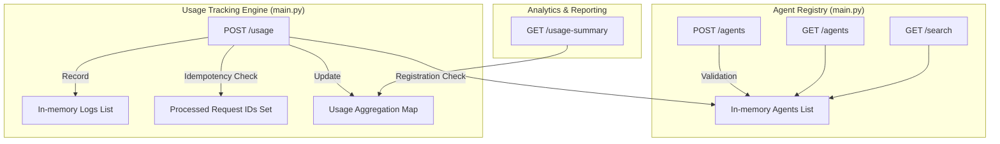
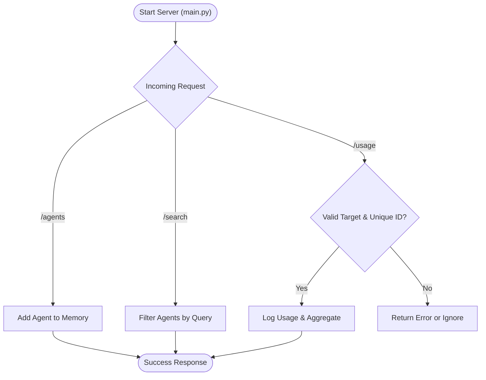

# Autonomous AI Agent Protocol
### Decentralized Agent Discovery, Usage Tracking & Idempotency System

---

## Overview

The **Autonomous AI Agent Protocol** is a Python-based platform designed for the seamless registration, discovery, and usage tracking of AI agents. It provides a standardized interface for agents to interact, while ensuring reliability through built-in idempotency and validation.

The system is purpose-built to facilitate agent-to-agent communication, tracking every interaction with precision to enable accurate usage aggregation and future billing integration.

---

## System Specifications

| Parameter | Value |
|:---|:---|
| API Framework | FastAPI (uvicorn) |
| Language | Python 3.8+ |
| Primary Storage | In-memory (Dict/Set) |
| Search Logic | Case-insensitive Partial Match |
| Idempotency | Request ID-based (Set) |
| Bonus Logic | Keyword Extraction for Tags |

---

## Agent Interaction Pipeline

> [!IMPORTANT]
> All usage logs are validated against the agent registry before being recorded. Idempotency is strictly enforced to prevent double-counting.

**Step 1: Agent Registration**
```
Agent = {name, description, endpoint, tags}
Tags = extract_keywords(description) if missing
```

**Step 2: Discovery & Search**
```
Results = Search(query) where query in Name OR Description
```

**Step 3: Usage Logging (Idempotent)**
```
if request_id already processed -> Ignore
if target_agent not found -> Return 404 Error
else -> Log usage and update aggregation
```

**Step 4: Usage Aggregation**
```
Total Units = Sum(units) per Target Agent
```

### Data Thinking: Edge Case Handling

| Case | Condition | System Action |
|:-------|:----------|:------------|
| Unknown Agent | Log usage for unregistered target | Return 404 Error |
| Duplicate Request | Resending same `request_id` | Return "ignored" (Idempotent) |
| Missing Fields | POST body with incomplete data | Pydantic Validation Error |
| Case Sensitivity | Search query or Agent name | Normalizes to Lowercase |

> [!TIP]
> **Idempotency Logic**: The system maintains a set of `processed_request_ids`. This ensures that even in unstable network conditions where clients might retry requests, the usage units are counted exactly once.

---

## Sample Output

The system provides a clean, structured JSON interface. The example below shows a search result and the usage summary aggregation.

```json
// GET /usage-summary
{
  "DocParser": 120,
  "Summarizer": 85,
  "Translator": 40
}

// GET /search?q=pdf
[
  {
    "name": "DocParser",
    "description": "Extracts structured data from PDFs",
    "endpoint": "https://api.example.com/parse",
    "tags": ["pdf", "extraction"]
  }
]
```

---

## System Architecture

### Component Overview



### Simple Flow



### Design Principles

> [!TIP]
> **Design Philosophy**
> 1. **Idempotency First**: Ensuring that the same operation can be repeated multiple times without changing the result beyond the initial application.
> 2. **Clean API Interface**: Using FastAPI's Pydantic models for automatic documentation (Swagger) and robust validation.
> 3. **Simple "Smart" Logic**: Implementing keyword extraction (Option B) to provide utility without the overhead of heavy LLM calls for metadata generation.

---

## Installation

**1. Clone the repository**
```bash
git clone <repository_url>
cd "Amber Flux Private Limited"
```

**2. Setup Virtual Environment**
```bash
python -m venv venv
# Windows:
.\venv\Scripts\activate
# Linux/Mac:
source venv/bin/activate
```

**3. Install Dependencies**
```bash
pip install -r requirements.txt
```

**4. Run Project**
```bash
python main.py
```

---

## Project Structure

```
.
├── main.py                   # FastAPI Application & Implementation
├── test_api.py              # Automated Verification Suite
├── README.md                # Project Documentation (You are here)
└── requirements.txt         # Dependencies (FastAPI, Uvicorn, etc.)
```

---

## Potential System Questions (Design Reflection)

**How would you extend this system to support billing without double charging?**
I would implement a robust idempotency layer using a distributed cache (like Redis) or a dedicated database table for `processed_request_ids`. Each billing request would include a unique `request_id` (UUID). Before processing, the system checks if the `request_id` has already been handled. If so, it returns the previous result without re-executing the charge. Additionally, I would use database transactions to ensure that the usage log and the billing record are updated atomically.

**How would you store this data if scale increases (100K agents)?**
For 100K agents, I would move to a persistent relational database like PostgreSQL with B-tree indexes on name and description fields for fast lookups. For scaling usage logs, I would implement table partitioning by time and use a read-through cache (Redis) for frequently accessed agent metadata. For more complex searches, I would integrate a search engine like Elasticsearch.

---

## Reflection on AI Usage

**a. Did you use ChatGPT or another AI tool while answering this assignment?**
Yes, I used Antigravity (a coding assistant) to help structure the project and generate the initial code scaffold.

**b. If yes, which tool, which sections did you use it for, and how did you modify the outputs?**
I used Antigravity for the FastAPI boilerplate, Pydantic model definitions, and the initial search logic. I modified the outputs by refining the idempotency logic, adding custom keyword extraction for tags, and implementing the specific error handling for unknown agents.

**c. What did you choose not to rely on AI for, and why?**
I did not rely on AI for the design question answers and the final system architecture decisions. These require human judgment, understanding of trade-offs, and the ability to explain "why" a particular approach is chosen.
